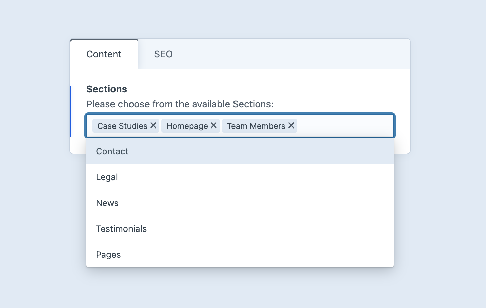

<p align="center">
    
</p>

# Sections Field Plugin for Craft CMS 5

Enhance your Craft CMS experience with the Sections Field plugin, allowing users to select from a list of sections on the site with a simple multi-select field.

## Features

### Multi-Select Section Field

- Adds a new field type to Craft CMS for selecting sections.
- Supports multi-selection for greater flexibility.
- Works seamlessly with Craft’s existing field system.



### Intuitive UI

- Designed to match the native Craft CMS interface.
- Uses built-in Craft UI elements for a smooth user experience.
- Custom field settings allow for tailored selection options.

### Lightweight & Configurable

- No extra database overhead—uses Craft’s native section data.

## Requirements

This plugin requires Craft CMS 5.0.0 or later.

## Installation

You can install this plugin from the Plugin Store or with Composer.

#### From the Plugin Store

Go to the Plugin Store in your project’s Control Panel and search for “Sections Field”. Then press “Install”.

#### With Composer

Follow these steps to install Sections Field:

1. In your terminal, go to your Craft project:

        cd /path/to/your-project

2. Run the composer require command for the plugin:

        composer require honchoagency/craft-sections-field

3. Then, in the CLI, install the plugin using:

        ./craft plugin/install sections-field

   Alternatively, in the Control Panel, go to Settings → Plugins and click the “Install” button for Sections Field.

## Usage
The `SectionsFieldData` class provides multiple helper methods for accessing section data. Below is a list of available methods and their functionality.

### Element Query Example

**Twig Example:**
```twig

```

### Methods

#### `names(): array`
Returns an array of section names that are currently selected.

**Twig Example:**
```twig

    {{ name }}

```

#### `handles(): array`
Returns an array of section handles that are currently selected.

**Twig Example:**
```twig

    {{ handle }}

```

#### `ids(): array`
Returns an array of section IDs that are currently selected.

**Twig Example:**
```twig

    {{ id }}

```

#### `sections(): array`
Returns an array of Craft section objects corresponding to the selected sections.

**Twig Example:**
```twig

    {{ section.name }}

```

Created by [Honcho Agency](https://honcho.agency)
